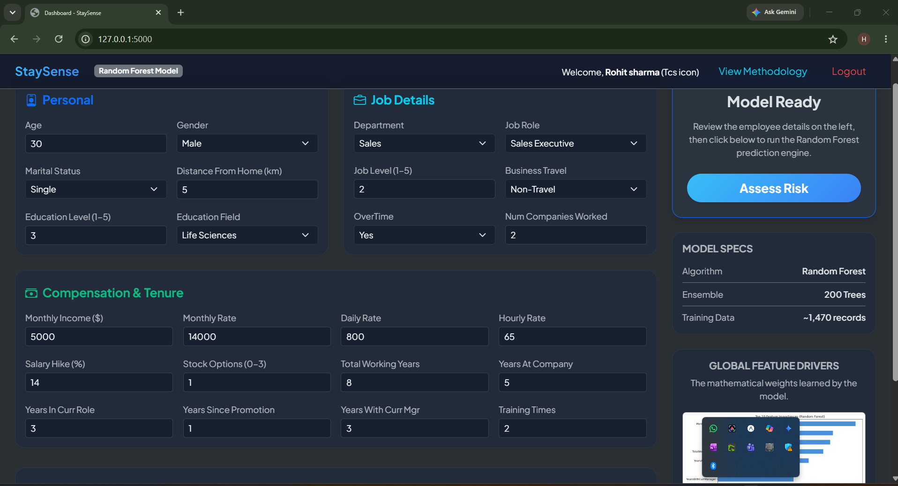
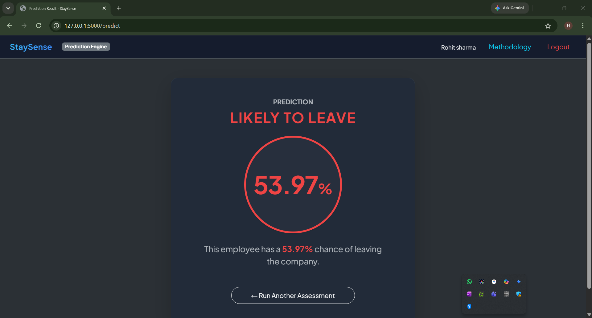
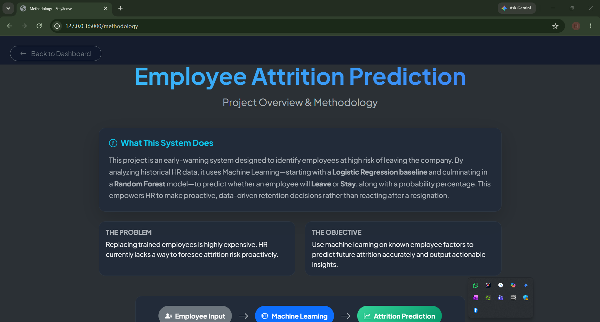
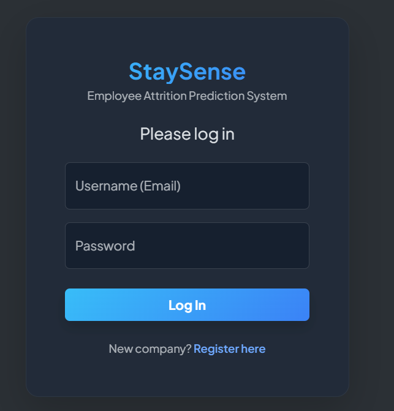
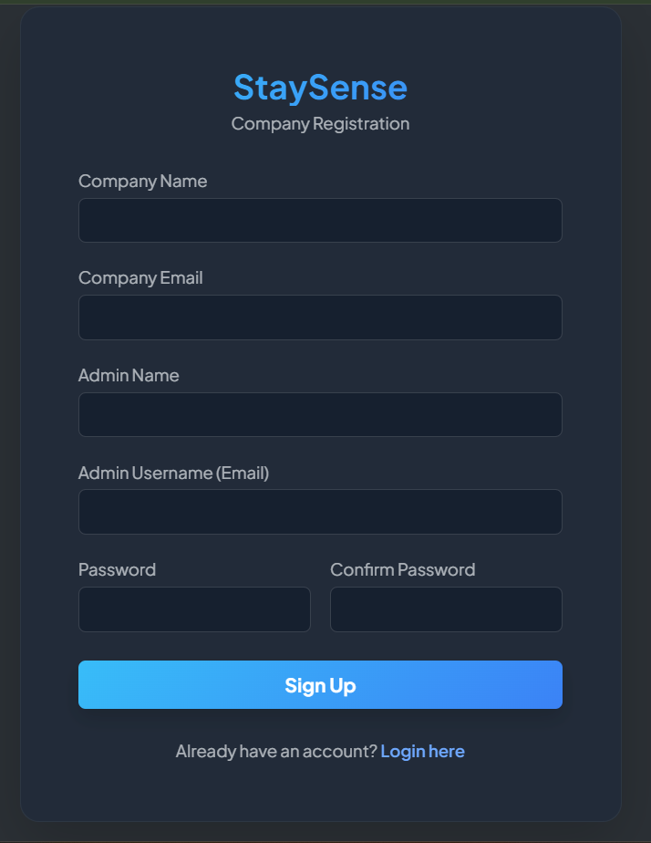

# Employee Attrition Prediction System

A complete Machine Learning and Web Application project designed to predict employee attrition. This proactive HR tool uses historical employee data to identify individuals at high risk of leaving the company, empowering HR and leadership to take data-driven retention measures before a resignation occurs.

## 📌 Project Overview
- **Problem Statement:** Replacing trained employees is highly expensive, and human resources departments traditionally lack quantitative methods to foresee attrition risk proactively.
- **Objective:** Utilize machine learning to analyze known employee factors, predict future attrition accurately, and output actionable risk probabilities.
- **Key Features:** 
  - Complete ML pipeline (Data -> Preprocessing -> Feature Engineering -> Model -> Prediction).
  - Web interface with secure MongoDB-based user/company authentication.
  - "Leave" or "Stay" prediction with a confidence probability (%).
  - Professional Methodology dashboard explaining the models and system architecture.

## 🧠 Machine Learning Methodology

### The Dataset
The project uses the **IBM HR Analytics Employee Attrition & Performance** dataset (`WA_Fn-UseC_-HR-Employee-Attrition.csv`). 
During **Feature Engineering**, 4 columns with zero mathematical variance (`EmployeeCount`, `StandardHours`, `Over18`, `EmployeeNumber`) were dropped. The remaining **30 categorical and numerical factors** were label-encoded and scaled.

### The Models
1. **Logistic Regression (Baseline Model)**
   - Used to establish a performance baseline using a standard linear approach. It struggled to capture complex, non-linear human behavior patterns.
2. **Random Forest Classifier (Final/Main Model)**
   - An ensemble of decision trees. Selected as the final model because it successfully captures complex interactions between HR factors (e.g., income, overtime, and satisfaction).

### Model Performance Metrics
| Metric | Logistic Regression | Random Forest (Final) |
| :--- | :--- | :--- |
| **Accuracy** | 87.41% | 82.65% |
| **Precision** | 69.23% | 46.30% |
| **Recall** | 38.30% | **53.19%** |
| **F1 Score** | 49.32% | **49.50%** |

**Why Random Forest?** In attrition prediction, raw accuracy can be misleading. The most critical metric is **Recall** (the ability to successfully identify the people who are actually going to leave). Random Forest provided significantly higher Recall.

## 🔐 System Architecture & MongoDB Authentication
The web interface is built using **Flask** (Python) and **Bootstrap 5** (HTML/CSS).
**MongoDB** is strictly used for the **Authentication & Database** layer:
- Handles company and user Sign-Up and Login functionality.
- Securely hashes passwords and associates users with their respective companies.
- Restricts the prediction engine to authorized administrators only.
*(Note: MongoDB is not used to store the ML dataset or models).*

## 📂 Project Structure
```text
.
├── app.py                   # Main Flask application and backend routes
├── train_model.py           # ML script to preprocess data and train/save the models
├── requirements.txt         # Python dependencies
├── .env.example             # Example environment variables (for GitHub safety)
├── .gitignore               # Excluded directories (like /venv, /__pycache__)
├── WA_Fn-UseC_-HR-Employee-Attrition.csv # The IBM HR Dataset
├── model/                   # Serialized ML artifacts (.pkl)
│   ├── attrition_model.pkl  # Trained Random Forest model
│   ├── scaler.pkl           # StandardScaler object
│   ├── label_encoders.pkl   # Categorical encoders
│   └── feature_columns.pkl  # List of ordered feature columns
├── static/                  # CSS stylesheets and generated images
└── templates/               # Frontend HTML files (Bootstrap 5)
    ├── index.html           # Prediction form input page
    ├── result.html          # Prediction output UI (Leave/Stay + %)
    ├── methodology.html     # 3-slide project presentation dashboard
    ├── login.html           # MongoDB user login
    └── signup.html          # MongoDB user/company registration
```

## ⚙️ Software Prerequisites
- Python 3.8+
- MongoDB (running locally on default port `27017` or via a cloud URI)
- Git

## 🚀 Installation & Setup

1. **Clone the Repository:**
   ```bash
   git clone <your-github-repo-url>
   cd employee-attrition-prediction-main
   ```

2. **Create and Activate a Virtual Environment:**
   ```bash
   python -m venv venv
   # Windows:
   venv\Scripts\activate
   # Mac/Linux:
   source venv/bin/activate
   ```

3. **Install Dependencies:**
   ```bash
   pip install -r requirements.txt
   ```

4. **Ensure MongoDB is Running:**
   Ensure your local MongoDB daemon (`mongod`) is running. The application looks for a local instance at `mongodb://localhost:27017/` by default.

5. **(Optional) Re-train the Model:**
   The trained models are already provided in the `/model` directory. If you want to re-train them from scratch:
   ```bash
   python train_model.py
   ```

6. **Run the Application:**
   ```bash
   python app.py
   ```
   The application will start on `http://127.0.0.1:5000`.

## 🛡️ Security & Configuration Note
For academic evaluation purposes, `app.py` currently relies on hardcoded local configuration variables (like the Flask Secret Key and local MongoDB URI). 
Before deploying this to a live production server, refer to `.env.example` to implement environment variables via `os.environ.get()` and avoid exposing secrets.

## 📝 Usage
1. Open the app in your browser and click **Sign-Up** to register a test company and admin account.
2. **Login** using your new credentials.
3. Fill out the **Employee Form** with HR data.
4. Click **Assess Risk**.
5. The Random Forest model evaluates the input and the **Result Page** displays the Leave/Stay verdict alongside the exact probability confidence.
6. Click **Methodology** in the navbar to view the system dashboard and performance metrics.

## ⚠️ Limitations & Future Scope
- **Data Dependency:** The model is trained specifically on the IBM HR dataset. Its feature importances (e.g., Daily Rate, Distance From Home) may vary across different companies in real life.
- **Future Integration:** Could be expanded to include live HR database pulling (e.g., direct Workday/SAP integration) rather than manual form entry.

## Application Screenshots

### Home / Employee Form


### Prediction Result


### Methodology Dashboard


### Login Page


### Sign Page


---
*Developed as an Academic Project for MCA / Data Science evaluation.*
